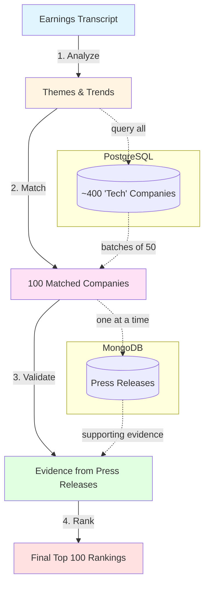

# AI Theme Plays 🎯

**Turn earnings call transcripts into actionable investment insights.**

This deep agent analyzes corporate earnings transcripts (e.g., NVIDIA's latest earnings call), extracts strategic themes and trends, then systematically matches thousands of companies to those themes—all backed by real press release evidence.

Think of it as an AI research analyst that goes from "NVIDIA talked about AI factories" to "here are 100 ranked companies building AI infrastructure, with evidence proving it."

## Why This Matters

When a market leader telegraphs a major shift (AI infrastructure, quantum computing, robotics), you want to:
1. **Understand the themes** - What exactly are they betting on?
2. **Find aligned companies** - Who else is building in this space?
3. **Validate with evidence** - Can we prove they're actually doing it?
4. **Rank by strength** - Who's leading vs. following?

Manual analysis would take weeks. This agent does it in minutes, processing hundreds of companies against multiple themes.

## The Pipeline



## The Four Subagents

### 1. **Transcript Analyzer** 📝
**Input:** Raw earnings transcript  
**Output:** Structured themes, trends, focus areas, strategic insights

**Why:** Converts unstructured CEO commentary into machine-readable themes. Instead of "Jensen talked about AI," you get "AI Factory Revolution: specialized infrastructure for token generation at scale."

### 2. **Company Matcher** 🔍
**Input:** Themes from step 1 + PostgreSQL (2400+ tech companies)  
**Output:** Top 100 companies ranked by theme alignment

**Why:** Systematically evaluates EVERY company against the themes. No human bias, no missed opportunities. Processes sequentially (batch_0000, batch_0050, etc.) to avoid context overflow.

**Key Feature:** Built-in sequential enforcement—the agent literally cannot skip batches or cherry-pick companies.

### 3. **Press Release Validator** ✅
**Input:** Matched companies + MongoDB (press releases)  
**Output:** Validation results with evidence

**Why:** Matching is just hypothesis. This proves it with real-world evidence. For each company: "Do their press releases actually show they're building in this space?"

Returns structured evidence like:
```json
{
  "evidence": "Launched AI-powered autonomous driving platform",
  "pr_title": "XPeng Announces Turing AI System",
  "pr_link": "https://..."
}
```

### 4. **Final Ranker** 🏆
**Input:** Matches + Validations  
**Output:** Re-ranked top 100 with final scores

**Why:** Combines everything. If validation boosted confidence (+0.2), the company moves up in rankings. Creates one clean output with all the data merged.

## Data Flow

**Sequential Processing:**
- Company batches: `batch_0000.json` → `batch_0050.json` → `batch_0100.json` → ...
- Validation files: `company_NVDA.json`, `company_MSFT.json`, etc.

**Why batch files?** Context management. Each batch is written to S3, then the agent forgets it and moves on. This allows processing thousands of companies without hitting token limits.

**Final outputs:**
- `themes_analysis.json` - The extracted themes
- `matched_companies.json` - Top 100 matches with scores
- `validated_results.json` - Evidence from press releases
- `final_rankings.json` - **The money shot**: Re-ranked companies with all data merged

## Key Features

### 🔒 Sequential Enforcement
Built into the tools themselves. The agent **cannot** skip batches or companies:
- `get_companies_from_postgres` tracks expected offset (0, 50, 100, 150...)
- Invalid offset? Tool returns error JSON instead of data
- `get_press_releases_from_mongodb` blocks duplicates and multi-company queries

### 📦 Context Management
- `ContentTruncationMiddleware` - Proportionally truncates message content to fit 179K token limit
- Batch file strategy - Write intermediate results, forget, continue
- Tool-level validation - Pydantic models ensure data integrity

### 🎯 Type Safety
All inputs/outputs use Pydantic models:
- `ThemesOutput`, `CompanyMatchesOutput`, `ValidationOutput`, `FinalOutput`
- Auto-validation, clear schemas, single source of truth

## Configuration

```python
# config.py
COMPANY_BATCH_SIZE = 50          # Companies per batch
PRESS_RELEASE_BATCH_SIZE = 100   # Press releases to fetch per company
TOP_COMPANY_MATCHES = 100        # How many companies to rank
CONTEXT_WINDOW_TOTAL = 200_000   # Claude's context limit
MAX_OUTPUT_TOKENS = 16_000       # Reserve for responses
```

## Usage

```bash
uv run run_deepagent.py
```

The agent:
1. Reads transcript from S3 (`transcripts/transcript.txt`)
2. Queries PostgreSQL for company data
3. Queries MongoDB for press releases
4. Writes all outputs to S3 (`deepagent_runs/{run_name}/...`)

## Tech Stack

- **LangChain/LangGraph** - Agent framework
- **DeepAgents** - Subagent middleware
- **PostgreSQL** - Company database
- **MongoDB** - Press releases
- **S3** - Data storage (Cloudflare R2)
- **Claude Sonnet 4.5** - LLM (200K context)

## The Result

You get a ranked list of 100 companies with:
- Match scores (why they fit the themes)
- Validation evidence (press releases proving it)
- Final rankings (adjusted by evidence quality)

All fully traceable, fully automated, fully systematic. No "vibes," no cherry-picking—just data. 📊
